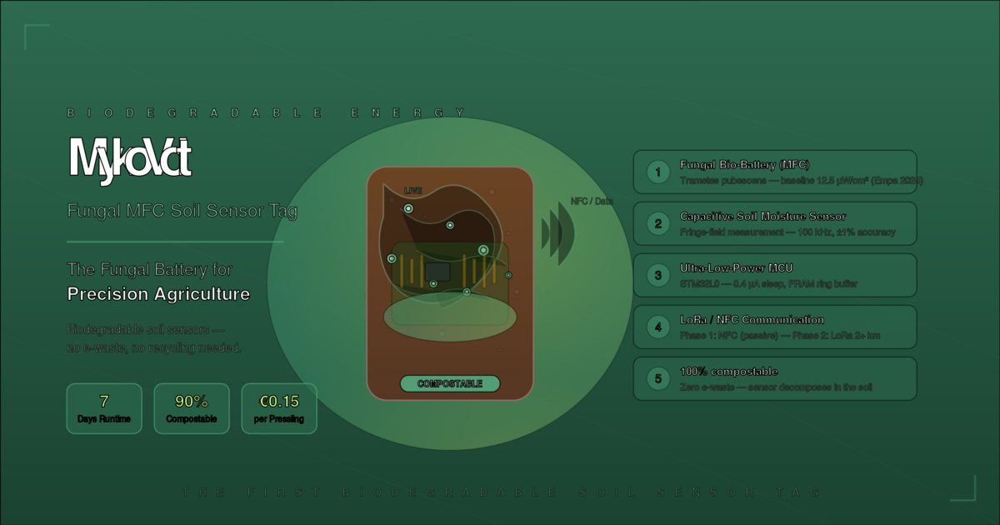
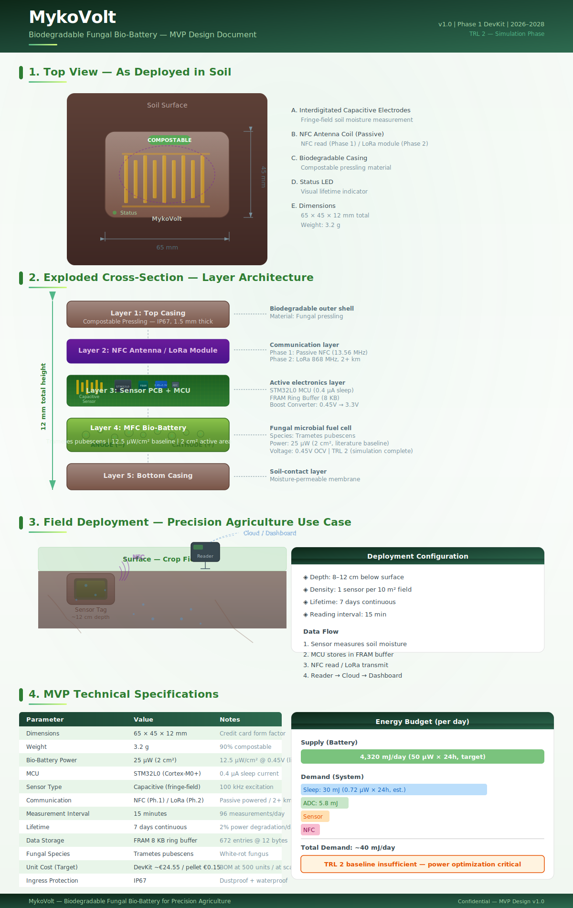
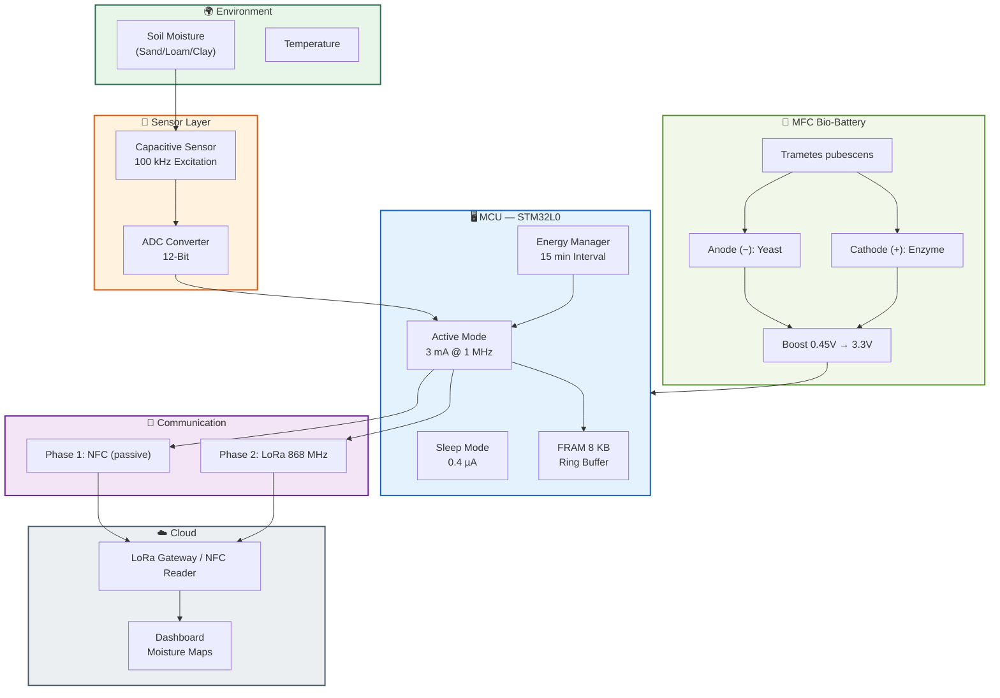
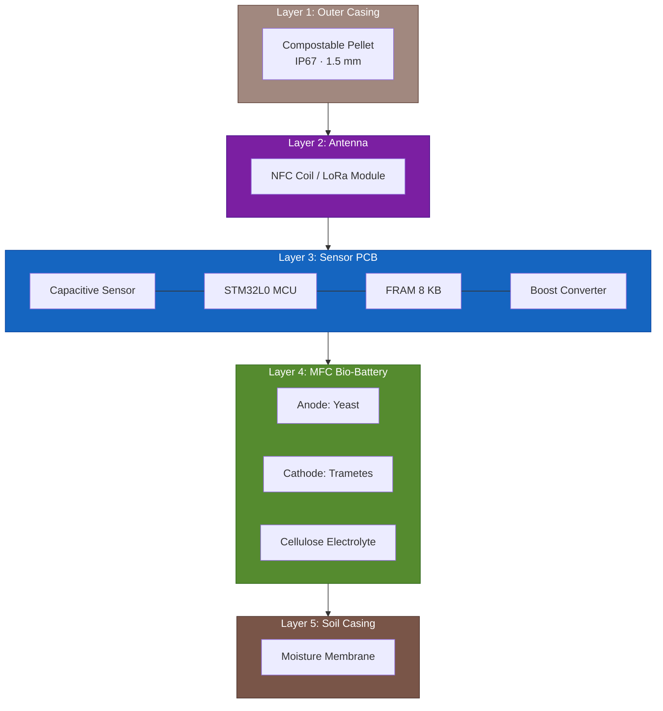
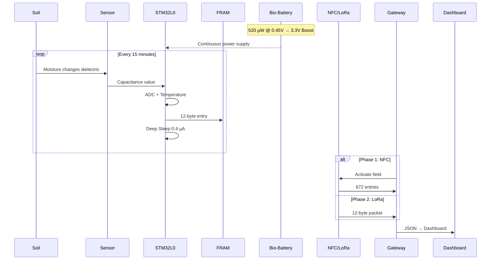
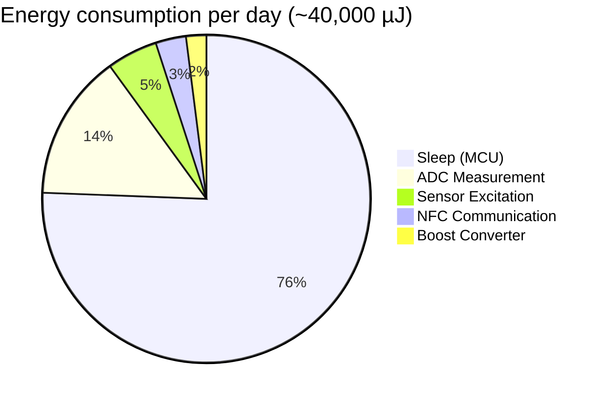
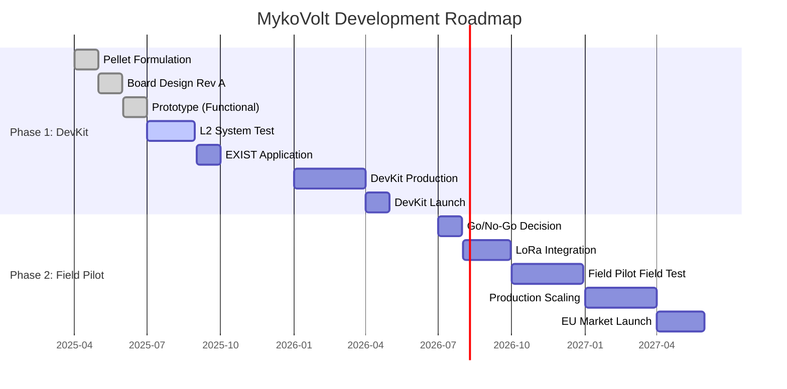
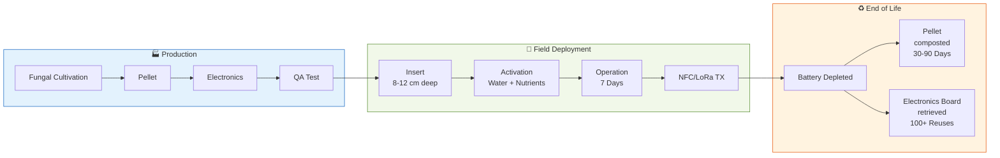
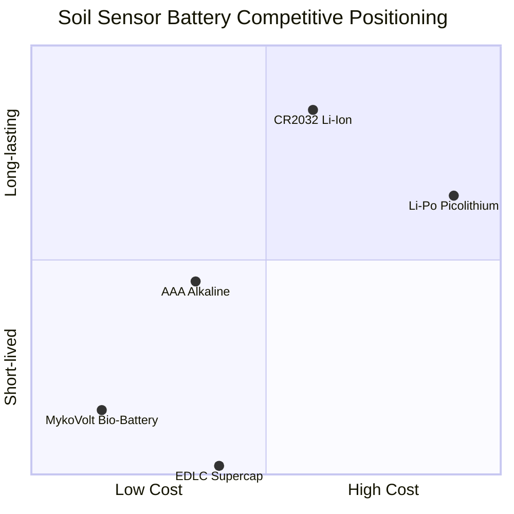

# MykoVolt — Biodegradable Fungal Battery for Precision Agriculture

<p align="center">
  
</p>

<p align="center">
  <b>The first compostable soil moisture sensor application.</b><br>
  7 days runtime · 90% biodegradable · €0.15 per unit · Zero e-waste
</p>

## Table of Contents

- [Overview](#overview)
- [MVP Design](#mvp-design)
- [System Architecture](#system-architecture)
  - [Signal Flow](#signal-flow)
  - [Layer Stack](#layer-stack)
  - [Data Flow](#data-flow)
- [Technical Specifications](#technical-specifications)
  - [DevKit (Phase 1)](#devkit-phase-1)
  - [Field Pilot (Phase 2)](#field-pilot-phase-2)
  - [Technology Stack](#technology-stack)
  - [Energy Budget](#energy-budget)
- [Product Roadmap](#product-roadmap)
- [Deployment Lifecycle](#deployment-lifecycle)
- [Competitive Positioning](#competitive-positioning)
- [Project Structure](#project-structure)
- [Getting Started](#getting-started)
- [Development Progress](#development-progress)
- [Contact](#contact)
- [License](#license)

---

## Overview

MykoVolt develops the first commercial, biodegradable fungal bio-battery to power soil moisture sensors in precision agriculture. The technology uses microbial fuel cells (MFC) based on white-rot fungi (*Trametes pubescens*, *Phanerochaete chrysosporium*), embedded in a compostable pellet.

### Key Innovation
- **Biodegradable**: Fungus-based bio-battery + compostable casing
- **Reusable**: Electronics board (100+ cycles)
- **Hybrid approach**: Immediate market entry with full biodegradability as long-term goal

---

## MVP Design

<p align="center">
  
</p>

---

## System Architecture

### Signal Flow



### Layer Stack



### Data Flow



---

## Technical Specifications

### DevKit (Phase 1)

| Parameter | Value |
|-----------|-------|
| Fungal strain | *Trametes pubescens* (12.5 µW/cm²) |
| Communication | NFC (passive powered) |
| Energy consumption | ~0.14 mWh/day |
| Data format | 12-byte entries (timestamp, capacitance, voltage, temperature, status) |
| Duration | 14 days at 15-minute intervals |

### Field Pilot (Phase 2)

| Parameter | Value |
|-----------|-------|
| Fungal strain | *Phanerochaete chrysosporium* (expected 150× more power) |
| Communication | LoRa (868 MHz, 2+ km) |
| Energy consumption | ~0.60 mWh/day (SF12), ~0.09 mWh/day (SF7) |
| Casing | IP67, field-ready |

### Technology Stack

| Layer | Component | Technology |
|-------|-----------|------------|
| MCU | STM32L0 (Cortex-M0+) | Sensor data processing and storage |
| Memory | MB85RC256 FRAM (32 KB) | High-reliability data storage |
| Communication | Passive NFC / SX1276 LoRa | Data transmission |
| Power | Trametes pubescens MFC | Energy generation from organic waste |
| Casing | Compostable pellet | Protection and biodegradability |
| Firmware | STM32 HAL C11 | Sensor data acquisition and processing |
| Simulation | Python | Soil moisture sensor simulation |

### Energy Budget




---

## Product Roadmap



---

## Deployment Lifecycle



---

## Competitive Positioning



---

## Project Structure

```
mykovolt/
├── docs/
│   ├── diagrams.html          # Full Mermaid diagram suite (12 diagrams)
│   ├── mvp_design.svg        # MVP exploded view & specifications
│   ├── teaser.svg             # Hero image
│   ├── manufacturing_process.md
│   └── supply_chain_analysis.md
├── simulation/
│   └── e2e_soil_sensor.py     # End-to-end sensor simulation
├── tests/
│   └── battery_validation.py
├── competitive/
│   └── intelligence_dashboard.py
├── compliance/
│   └── regulatory_roadmap.md
├── finance/
│   └── funding_strategy.md
├── marketing/
│   └── segment_strategies.md
├── ip/
│   └── ip_strategy.md
├── archive/                   # Historical documents
├── MykoVolt-mvp-design.md     # Full MVP design documentation
├── MykoVolt_Angebot_EMC.md     # EMC GmbH offer
├── MykoVolt_Pitch_Deck.html    # Interactive pitch deck
└── README.md
```

---

## Getting Started

### Prerequisites
- Python 3.8+
- STM32CubeProgrammer (for NFC reader)
- LoRa stack (for field pilot)

### Installation
```bash
git clone https://github.com/tobias-weiss-ai-xr/mykovolt.git
cd mykovolt
pip install -r requirements.txt
```

### Running Tests
```bash
pytest simulation/
```

---

## Development Progress

| Phase | Status | Completion |
|-------|--------|------------|
| DevKit Design | ✅ Complete | 100% |
| Prototype | ✅ Complete | 100% |
| Simulation | ✅ Complete | 100% |
| Business Plan | ✅ Complete | 100% |
| Field Test | ⏳ In Progress | 25% |
| Production | ⏳ Planned | 0% |

---

## Contact

- **GitHub**: [tobias-weiss-ai-xr/mykovolt](https://github.com/tobias-weiss-ai-xr/mykovolt)
- **Email**: tobias@tobias-weiss.org

## License

This project is licensed under the MIT License.

---

*Last updated: $(git log --format="%cd" --date=short -1)*
