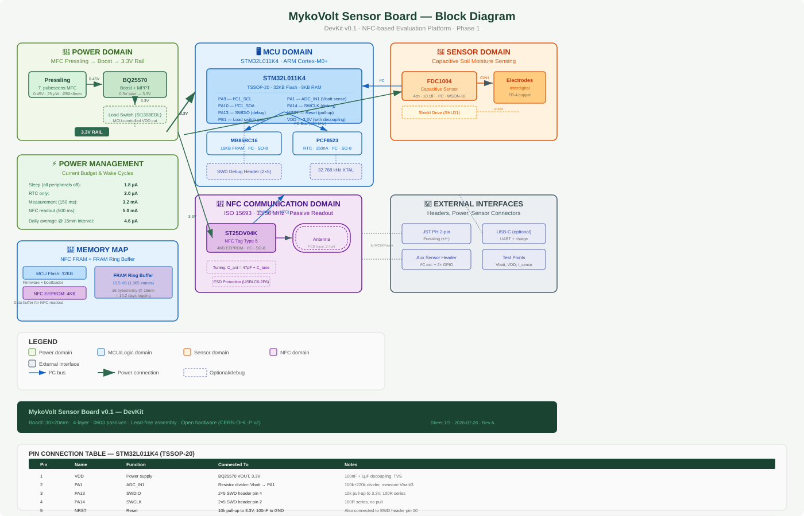
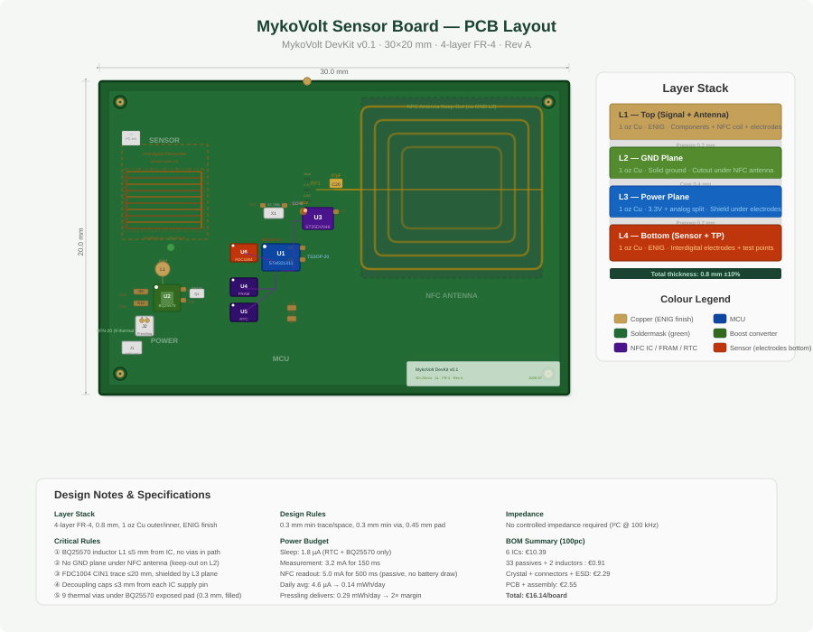

# MykoVolt Sensor Board — Hardware Design

> **Board:** DevKit v0.1 · 30×20 mm · 4-layer FR-4 · Rev A  
> **License:** CERN-OHL-P v2 · **Status:** Design complete, pre-layout

---

## 1. Board Overview

NFC-enabled data acquisition board powered by a fungal MFC pressling. Takes soil capacitance measurements every 15 minutes, stores them in FRAM, and serves them on demand via any NFC phone.

### Key Specs

| Parameter | Value | Notes |
|-----------|-------|-------|
| MCU | STM32L011K4 | 32 KB Flash, 8 KB RAM, TSSOP-20 |
| Boost | BQ25570 | 0.3 V cold-start, MPPT, 80 nA Iq |
| NFC | ST25DV04K | 4 KB EEPROM, I²C, passive readout |
| FRAM | MB85RC16 | 16 KB, 10¹³ cycles, I²C |
| RTC | PCF8523 | 150 nA, century register, I²C |
| Sensor | FDC1004 | 4-ch capacitive, ±0.1 fF, I²C |
| Sleep power | **1.8 µA** | STOP with RTC |
| Daily avg | **4.6 µA** (0.14 mWh) | @ 15 min interval |
| Input | 0.3–0.6 V | From pressling |
| Output | 3.3 V | Regulated rail |
| NFC range | 2–5 cm | Phone/reader dependent |

### Stack-up

| Layer | Material | Thickness | Purpose |
|-------|----------|-----------|---------|
| L1 (Top) | 1 oz Cu + ENIG | 35 µm | Components, NFC antenna |
| L2 (GND) | 1 oz Cu | 35 µm | Solid ground, cutout under antenna |
| L3 (PWR) | 1 oz Cu | 35 µm | 3.3 V + analog shield split |
| L4 (Bot) | 1 oz Cu + ENIG | 35 µm | Interdigital electrodes, test points |
| Core | FR-4 | 0.8 mm | — |

**Why 4-layer:** BQ25570 QFN-20 needs a solid GND plane for thermal dissipation. A 2-layer board increases noise on the capacitive sensor. Cost difference: ~€3 → ~€8 for 5 boards.

---

## 2. Block Diagram



*Five domains: Power (BQ25570 + pressling), MCU (STM32L011 + FRAM + RTC), Sensor (FDC1004 + electrodes), NFC (ST25DV04K + antenna), Interfaces (headers + test points). I²C bus at 100 kHz connects all peripherals.*

### Power Tree

```
Pressling (0.3–0.6 V, 25 µW)
    │
    ▼ BQ25570 (boost, 85 % eff @ 50 µW)
    │
    ▼ 3.3 V rail
    │
    ├── Always-on: RTC (150 nA) + BQ25570 idle (80 nA) = 230 nA
    │
    └── Switched (SI1308EDL P-MOSFET): MCU + FRAM + NFC + Sensor
        → OFF 99.9 % of time, ON only during measurement (~150 ms)
```

### I²C Bus

| Device | Address (7-bit) | Function |
|--------|----------------|----------|
| ST25DV04K | 0x53 | NFC EEPROM |
| MB85RC16 | 0x50 | FRAM ring buffer |
| FDC1004 | 0x51 | Capacitive sensor |
| PCF8523 | 0x52 | Real-time clock |

**Address conflict resolved:** FDC1004 ADDR pin → VDD (0x51), PCF8523 ADDR pin → 10 kΩ to VDD (0x52).

### Memory Map (FRAM: 16 KB)

| Range | Size | Content |
|-------|------|---------|
| 0x0000–0x00FF | 256 B | System header (magic, version, write pointer) |
| 0x0100–0x3FFF | 16 KB – 256 B | Ring buffer, 1022 entries × 16 B = **14.2 days** @ 15 min |

**Ring buffer entry (16 B):** timestamp (uint32) + capacitance (uint16) + Vbatt (uint16) + temp (uint16) + ADC aux (uint16) + flags (uint8) + CRC (uint8) + reserved (2 B).

---

## 3. PCB Layout



*30×20 mm board with 4-layer stack, NFC antenna (right), MCU + I²C peripherals (center), power section (left), interdigital electrodes on bottom layer.*

### Component Placement

| Zone | Components |
|------|-----------|
| **Power** (left) | BQ25570 + L1 (10 µH) + voltage divider (R9/R10) + load switch Q1 + JST connector J2 |
| **MCU** (center) | STM32L011 + X1 (32.768 kHz) + decoupling caps + SWD header J1 |
| **I²C** (center-right) | MB85RC16 (FRAM) + PCF8523 (RTC) + FDC1004 (sensor) + pull-ups R1/R2 |
| **NFC** (right) | ST25DV04K + 4-turn PCB antenna (24×14 mm) + tuning cap C20 |
| **Sensor** (bottom L4) | 10 interdigital fingers (0.3 mm trace/space, 15 mm length) + shield plane on L3 |
| **Test points** | TP1 (Vbatt), TP2 (3.3 V), TP3 (GND) |

### Critical Layout Rules

1. **L1 (inductor)** ≤ 5 mm from BQ25570, no vias in switching path
2. **No copper** on L2 under NFC antenna (keep-out zone 28×18 mm)
3. **CIN1 trace** (FDC1004 → electrodes) ≤ 20 mm, shielded by L3 plane
4. **Decoupling caps** ≤ 3 mm from each IC supply pin
5. **9 thermal vias** (0.3 mm, filled) under BQ25570 exposed pad
6. **0.3 mm** min trace/space, **0.3 mm** min via — JLCPCB standard

---

## 4. Bill of Materials

### ICs

| Ref | Part | Pkg | Qty | Mouser SKU | Price 1pc | Price 100 |
|-----|------|-----|:---:|------------|----------:|----------:|
| U1 | STM32L011K4 | TSSOP-20 | 1 | [511-STM32L011K4](https://www.mouser.de/c/?q=511-STM32L011K4) | €2.15 | €1.52 |
| U2 | BQ25570 | QFN-20 | 1 | [595-BQ25570](https://www.mouser.de/c/?q=595-BQ25570) | €3.95 | €3.20 |
| U3 | ST25DV04K | SO-8 | 1 | [511-ST25DV04K](https://www.mouser.de/c/?q=511-ST25DV04K) | €1.35 | €0.95 |
| U4 | MB85RC16 | SO-8 | 1 | [342-MB85RC16PNF-G](https://www.mouser.de/c/?q=342-MB85RC16PNF-G) | €2.10 | €1.65 |
| U5 | PCF8523 | SO-8 | 1 | [771-PCF8523T/1,118](https://www.mouser.de/c/?q=771-PCF8523T/1,118) | €0.75 | €0.52 |
| U6 | FDC1004 | WSON-10 | 1 | [595-FDC1004DSC](https://www.mouser.de/c/?q=595-FDC1004DSC) | €3.15 | €2.55 |
| | | | **6** | **IC total** | **€13.45** | **€10.39** |

### Passives (all 0603, 1 % resistors, X7R/C0G caps)

| Ref | Value | Qty | Mouser SKU | Price 100 |
|-----|-------|:---:|------------|----------:|
| R1, R2 | 2.2 kΩ (I²C pull-up) | 2 | [71-CRCW06032K20F](https://www.mouser.de/c/?q=71-CRCW06032K20F) | €0.005 |
| R3, R4 | 47 kΩ (MPPT divider) | 2 | [71-CRCW060347K0F](https://www.mouser.de/c/?q=71-CRCW060347K0F) | €0.005 |
| R5, R6 | 510 kΩ (VBAT_OK) | 2 | [71-CRCW0603510KF](https://www.mouser.de/c/?q=71-CRCW0603510KF) | €0.005 |
| R7, R8 | 1 MΩ (VOUT_SET) | 2 | [71-CRCW06031M00F](https://www.mouser.de/c/?q=71-CRCW06031M00F) | €0.005 |
| R9 | 100 kΩ (Vbatt div upper) | 1 | [71-CRCW0603100KF](https://www.mouser.de/c/?q=71-CRCW0603100KF) | €0.005 |
| R10 | 220 kΩ (Vbatt div lower) | 1 | [71-CRCW0603220KF](https://www.mouser.de/c/?q=71-CRCW0603220KF) | €0.005 |
| R11 | 22 Ω (SWDIO series) | 1 | [71-CRCW060322R0F](https://www.mouser.de/c/?q=71-CRCW060322R0F) | €0.005 |
| R12 | 100 Ω (SWCLK series) | 1 | [71-CRCW0603100RF](https://www.mouser.de/c/?q=71-CRCW0603100RF) | €0.005 |
| C1–C10 | 100 nF X7R 16V | 10 | [81-GRM188R71C104K](https://www.mouser.de/c/?q=81-GRM188R71C104K) | €0.008 |
| C11–C13 | 1 µF X5R 10V | 3 | [81-GRM188R61A105K](https://www.mouser.de/c/?q=81-GRM188R61A105K) | €0.015 |
| C14, C15 | 10 µF X5R 6.3V (0805) | 2 | [81-GRM21BR60J106K](https://www.mouser.de/c/?q=81-GRM21BR60J106K) | €0.025 |
| C16, C17 | 22 pF C0G 50V | 2 | [81-GRM1885C1H220J](https://www.mouser.de/c/?q=81-GRM1885C1H220J) | €0.008 |
| C18, C19 | 100 pF C0G 50V | 2 | [81-GRM1885C1H101J](https://www.mouser.de/c/?q=81-GRM1885C1H101J) | €0.008 |
| C20 | 47 pF C0G 50V (NFC tune) | 1 | [81-GRM1885C1H470J](https://www.mouser.de/c/?q=81-GRM1885C1H470J) | €0.008 |
| C21 | 4.7 µF X5R 10V (BQ in) | 1 | [81-GRM188R61A475K](https://www.mouser.de/c/?q=81-GRM188R61A475K) | €0.018 |
| | **Total passives** | **33** | | **~€0.28** |

### Inductors & Crystal

| Ref | Value | Pkg | Qty | Mouser SKU | Price 100 |
|-----|-------|-----|:---:|------------|----------:|
| L1 | 10 µH, 2A sat | 4×4 mm | 1 | [963-MLPD2012A100M](https://www.mouser.de/c/?q=963-MLPD2012A100M) | €0.35 |
| L2 | 47 µH, 0.5A sat | 3×3 mm | 1 | [810-MLZ2012A470M](https://www.mouser.de/c/?q=810-MLZ2012A470M) | €0.28 |
| X1 | 32.768 kHz, ±20 ppm, 12.5 pF | 3.2×1.5 mm | 1 | [732-SM32K32768K20](https://www.mouser.de/c/?q=732-SM32K32768K20) | €0.45 |

### Supercap & ESD

| Ref | Part | Pkg | Qty | Mouser SKU | Price 100 |
|-----|------|-----|:---:|------------|----------:|
| SC1 | 100 mF, 3.6 V, <5 µA leakage | Radial 8×12 | 1 | [598-DGH336Q3R6](https://www.mouser.de/c/?q=598-DGH336Q3R6) | €1.20 |
| D1 | USBLC6-2P6 (NFC ESD) | SOT-666 | 1 | [511-USBLC6-2P6](https://www.mouser.de/c/?q=511-USBLC6-2P6) | €0.35 |
| D2 | PESD5V0S1UB (VDD TVS) | SOD-523 | 1 | [771-PESD5V0S1UB](https://www.mouser.de/c/?q=771-PESD5V0S1UB) | €0.12 |

### Transistor, LEDs, Connectors

| Ref | Part | Pkg | Qty | Mouser SKU | Price 1pc |
|-----|------|-----|:---:|------------|----------:|
| Q1 | SI1308EDL (P-MOS, load switch) | SOT-323 | 1 | [781-SI1308EDL-T1-GE3](https://www.mouser.de/c/?q=781-SI1308EDL-T1-GE3) | €0.25 |
| LED1 | Green LED 0603 (power) | 0603 | 1 | [78-VAOL-S6GT4](https://www.mouser.de/c/?q=78-VAOL-S6GT4) | €0.08 |
| LED2 | Yellow LED 0603 (status) | 0603 | 1 | [78-VAOL-S6YT4](https://www.mouser.de/c/?q=78-VAOL-S6YT4) | €0.08 |
| — | 330 Ω resistor (LED current limit) | 0603 | 2 | [71-CRCW0603330RF](https://www.mouser.de/c/?q=71-CRCW0603330RF) | €0.005 |
| J1 | 2×5 box header, SH type (SWD) | 1.27 mm | 1 | [855-FTSH-105-01-L-DV-K](https://www.mouser.de/c/?q=855-FTSH-105-01-L-DV-K) | €0.55 |
| J2, J3 | JST PH 2-pin header | 2.0 mm | 2 | [306-PH2RA2WS](https://www.mouser.de/c/?q=306-PH2RA2WS) | €0.25 |
| — | JST PH housing (mating) | 2.0 mm | 2 | [306-PHR-2](https://www.mouser.de/c/?q=306-PHR-2) | €0.05 |
| — | Crimp pins (for cable) | — | 4 | [306-BPH-002T-P0.5S](https://www.mouser.de/c/?q=306-BPH-002T-P0.5S) | €0.03 |
| J4 | Test point loop | — | 4 | [710-5001](https://www.mouser.de/c/?q=710-5001) | €0.08 |

### BOM Summary

| Category | Count | Cost 1pc | Cost 100pc |
|----------|:-----:|:--------:|:----------:|
| ICs | 6 | €13.45 | €10.39 |
| Passives | 33 | €1.12 | €0.28 |
| Inductors + crystal | 3 | €0.70 | €0.63 |
| Supercap + ESD | 3 | €1.67 | €1.67 |
| MOSFET + LEDs + resistors | 5 | €0.42 | €0.10 |
| Connectors + wiring | 6+ | €1.85 | €1.37 |
| **BOM subtotal** | **56** | **€19.21** | **€14.44** |
| PCB (5 pcs / 100 pcs) | — | €3.00 | €0.75 |
| Assembly (5 pcs / 100 pcs) | — | €10.00 | €1.80 |
| **Total per board** | | **€32.21** | **€16.99** |

---

## 5. Firmware Architecture

### State Machine

```
RTC ON (150 nA) ──[15 min alarm]──► WAKE (50 µs) ──[load switch ON]──►
    ▲                                                                    │
    │                                                                    ▼
    │                                                            MEASURE (150 ms)
    │                                                         • FDC1004 read
    │◄── SLEEP ──[load switch OFF]── NFC WAIT ──[store]──• ADC Vbatt
                                       (50 ms if FD=1)      • FRAM ring buffer write
```

### Low-Power Configuration

- **STOP mode** with RTC running: 1.8 µA
- Wake sources: RTC alarm (15 min), NFC field detect, SWD debugger
- After wake: MSI 2.097 MHz (5 µs startup), enable load switch, wait 1 ms for 3.3 V, measure, store, sleep

### NFC Readout Protocol

1. Phone approaches → ST25DV04K detects field → asserts IRQ
2. MCU wakes → checks FD pin (PB5) → copies latest 256 B from FRAM to NFC EEPROM
3. Phone reads via ISO 15693 standard commands
4. MCU returns to sleep

**Phone app (future):** "MykoVolt Scanner" — scan tag, read data, export CSV.

---

## 6. Power Budget Simulation

The PCB power simulator (`../simulation/pcb_power_sim.py`) models the full energy chain with Monte Carlo on component tolerances.

| Scenario | Survival | Avg Power | Min Vcap | Lifetime |
|----------|:--------:|:---------:|:--------:|:--------:|
| **Typical** (7 d @ 15 min) | **100 %** | 8.07 µW | 3.597 V | ~37 d |
| **Conservative** (7 d @ 15 min) | **0 %** | 17.97 µW | 2.000 V | <1 d |
| 30 d typical | ✅ | 8.07 µW | 3.480 V | ✅ |
| 14 d typical | ✅ | — | 3.592 V | ✅ |
| 45 d typical | ❌ (aging) | — | 2.000 V | 37 d |

**Key findings:**
- **Pressling delivers 24 µW** → 13.3 µW after BQ25570 boost (55 % eff at low power)
- **Board consumes 8.07 µW** (standby dominated by supercap leakage)
- **1.65× margin** in typical conditions
- **Conservative bottleneck:** supercap leakage (5 µA × 3.3 V = 16.5 µW) — use <3 µA type
- **Lifetime limited by pressling aging** (~37 days with 45-day half-life)

**Run it:**
```bash
python3 ../simulation/pcb_power_sim.py --days 30     # 30-day simulation
python3 ../simulation/pcb_power_sim.py --monte-carlo  # full MC
```

---

## 7. Manufacturing

### PCB Order (JLCPCB)

| Parameter | Selection |
|-----------|-----------|
| Dimensions | 30×20 mm |
| Layers | 4 |
| Thickness | 0.8 mm |
| Copper | 1 oz all layers |
| Finish | **ENIG** (required for NFC antenna + electrodes) |
| Min trace/space | 0.3 mm / 0.3 mm |
| Min via | 0.3 mm, tented & filled |
| Qty | **5 pcs** + stencil |
| **Cost** | **~€18** (incl. ENIG + stencil + shipping) |

**⚠️ JLCPCB assembly stock check:** BQ25570 ✓, PCF8523 ✓, passives ✓.  
ST25DV04K, MB85RC16, FDC1004 — **not stocked** → hand-solder these.

### Assembly Order

1. Solder paste through stencil → place components (tweezers + microscope)
2. Hot air: BQ25570 (QFN-20), FDC1004 (WSON-10)
3. Iron: STM32L011 (TSSOP-20), SO-8s, 0603 passives
4. Inspect bridges → reflow if needed → clean with IPA

### Test Sequence

| Step | Action | Expected |
|------|--------|----------|
| 1 | Connect 0.5 V lab supply to J2 | 3.3 V ± 5 % at VSTOR |
| 2 | I²C scan | 4 devices: 0x50, 0x51, 0x52, 0x53 |
| 3 | NFC tap with phone | ST25DV04K detected |
| 4 | Quiescent current | <5 µA in sleep |
| 5 | Pressling connected | 3.3 V regulated, system runs |
| 6 | 7-day soil box test | All entries readable via NFC |

---

## 8. Procurement

One-click Mouser basket for prototype batch (5 boards + spares):

| Category | Approx. Cost |
|----------|:------------:|
| ICs (10× each) | ~€135 |
| Passives (100× each) | ~€15 |
| Inductors + crystal (10×) | ~€10 |
| Supercap + ESD (10×) | ~€15 |
| MOSFET + LEDs (10×) | ~€5 |
| Connectors + wiring (10×) | ~€20 |
| **PCB 5 pcs + stencil** | **~€18** |
| **Tools & consumables** (one-time) | **~€80** |
| **Total prototype investment** | **~€300** |

**Per board at scale:** €16.99 (100 pcs) → ~€8.50 (1k pcs, full SMT assembly).

---

*Design files: `docs/hardware/sensor_board_block_diagram.svg`, `sensor_board_layout.svg`*  
*Full BOM + shopping list: `docs/hardware/shopping_list.md`*  
*Power simulation: `simulation/pcb_power_sim.py`*
